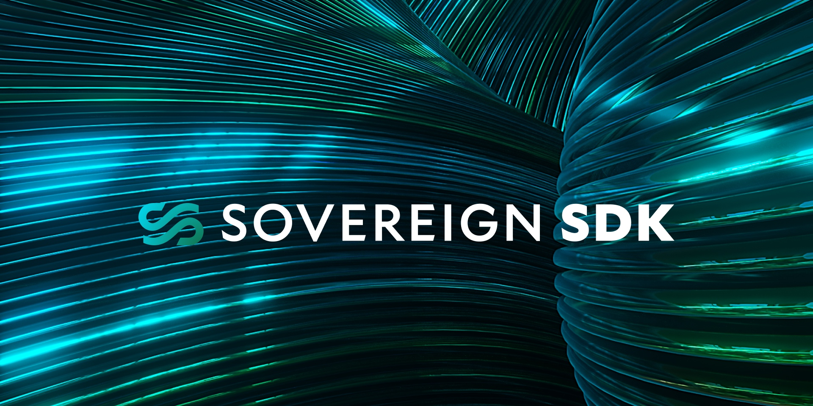

  
  
   

## What is the Sovereign SDK?

The Sovereign SDK is a free and open-source toolkit for building rollups (both ZK and optimistic) **that is currently under development**. Sovereign SDK consists of three
logical components:

1. The Rollup Interface, a minimal set of interfaces that defines a rollup
1. The Module System, an opinionated framework for building a rollup with the Rollup Interface
1. The Full Node, a client implementation capable of running any rollup which implements the Rollup Interface.

### The Rollup Interface

At the heart of the Sovereign SDK is [the Rollup Interface](./rollup-interface/specs/overview.md), which defines the _interfaces_ that rollups
must implement. In the Sovereign SDK, we define a rollup as the combination of three components:

1. A [State Transition Function](./rollup-interface/specs/interfaces/stf.md) ("STF") which defines the "business logic" of the rollup
1. A [Data Availability Layer](./rollup-interface/specs/interfaces/da.md) ("DA layer") which determines the set of transactions that are fed
   to the state transition function
1. A Zero Knowledge proving system (aka "Zero Knowledge Virtual Machine" or "ZKVM"), which takes the compiled rollup code and
   produces succinct proofs that the logic has been executed correctly.

One of the primary goals of the Sovereign SDK is to enable a clean separation of concerns between these three components.
Most rollup developers should not need to implement the DA layer interface - they can write their logic using the SDK,
and be compatible with any DA layer - so deploying their rollup on a new chain is as simple as
picking an [adapter](https://github.com/Sovereign-Labs/Jupiter)
to a specific DA layer off the shelf.

Similarly, teams building DA layers shouldn't need to worry about what kinds of state transitions will be built using their chain.
All they need to do is implement the DA layer interface, and they're automatically compatible with all state transition functions.

The code for the Rollup Interface lives in the [rollup-interface](./rollup-interface/) folder. For a technical description, we recommend the overview
[here](./rollup-interface/specs/overview.md). If you want a less technical introduction, see this [blog post](https://mirror.xyz/sovlabs.eth/pZl5kAtNIRQiKAjuFvDOQCmFIamGnf0oul3as_DhqGA).

### The Module System

While the Rollup Interface defines a powerful set of abstractions, it's unopinionated about how a State Transition Function should actually
work. As far as the interfaces are concerned, your state machine might have nothing to do with classic "blockchain" financial applications - so
it has no built-in notion of state, accounts, tokens, and the like. This means that the Rollup Interface package on its own can't offer a
"batteries included" development experience. But one of our goals at Sovereign is to make developing
a rollup as easy as deploying a smart contract. So, we've built out an additional set of tools for defining your state transition function
called the Module System.

At the heart of the Module System is the package [`sov-modules-api`](./module-system/sov-modules-api/). This package defines
a group of core traits which express how functionality implemented in separate modules can be combined into a `Runtime`
capable of processing transactions and serving RPC requests. It also defines macros for implementing most of these traits.
For many applications, defining your state transition function using the Module System should be as simple as picking
some modules off the shelf and defining a struct which glues them together.
To deliver this experience, the Module System relies on a set of common types and traits that are used in every module. The
`sov-modules-api` crate defines these traits (like `Context` and `MerkleTreeSpec`) and types like `Address`.

On top of the module API, we provide a [state storage layer](./module-system/sov-state/) backed by a [Jellyfish Merkle Tree](https://github.com/penumbra-zone/jmt)
and a bunch of helpful utilities for working with stateful transactions. Finally, we provide a set of modules implementing common
blockchain functionality like `Accounts`, and fungible `Tokens`.

For more information on the Module System, see its [README](./module-system/README.md). You can also find a tutorial on
implementing and deploying a custom module [here](./examples/demo-nft-module/README.md).

### The Full Node

The final component of this repository is the Full Node, which is a client implementation capable of running any
rollup that implements the Rollup Interface. The Full Node provides an easy way to deploy
and run your rollup. With the default configuration, it can automatically store chain data in its database,
serve RPC requests for chain data and application state, and interact with the DA layer to sync its state and send transactions.
While the full node implementation should be compatible with custom state transition functions, it is currently only tested for
rollups built with the Module System. If you encounter any difficulties running the full node, please reach out or open an
issue! All of the core developers can be reached via [Discord](https://discord.gg/kbykCcPrcA).

## Getting Started

### Running a demo rollup

Experience how a simple rollup works by exploring our [`demo-rollup`](./examples/demo-rollup/README.md) tutorial.

### Building a rollup

- #### Using the Module System
This is the most straightforward way to create a rollup.

To construct a single module, follow our [module building tutorial](./examples/demo-nft-module/README.md).
To combine multiple modules into a State Transition Function (STF), see the [`demo-stf`](./examples/demo-stf/README.md) guide.
- #### By building a custom State Transition Function
If you want even more control over your rollup's functionality, you can implement a completely custom State Transition Function without using the Module System. Our dedicated tutorial for this approach can be found [here](./examples/demo-simple-stf/README.md).

### Adding a new Data Availability Layer

If you want to add support for a new data availability layer, the easiest way to get started is to use the
[DA layer adapter template](https://github.com/Sovereign-Labs/da-adapter-template).

## Adapters

Adapters contain the logic integrating 3rd party codebases into the Sovereign SDK. Over time, we expect Sovereign SDK
to have adapters for almost all Data Availability Layers and LLVM-compatible proof systems. Currently, we
maintain adapters for [`Risc0`](https://www.risczero.com) (a ZKVM) and [`Celestia`](https://www.celestia.org) a (DA layer).
The Avail project also maintains an adapter for their DA layer, which can be found [here](https://github.com/availproject/avail-sovereign-da-adapter).
[Chainway](https://chainway.xyz/) team also maintains an open-source Bitcoin DA adapter for their Sovereign Rollup on Bitcoin, which can be found [here](https://github.com/chainwayxyz/bitcoin-da).

## Testing

An implementation of LLVM's libFUZZER is available under [fuzz/README.md](./fuzz/README.md).

## Warning

The Sovereign SDK is Alpha software. It has not been audited and should not be used in production under any circumstances.
API stability and compliance with semantic versioning will be maintained on a best-effort basis.

## License

Licensed under the [Apache License, Version
2.0](./LICENSE).

Unless you explicitly state otherwise, any contribution intentionally submitted
for inclusion in this repository by you, as defined in the Apache-2.0 license, shall be
licensed as above, without any additional terms or conditions.
