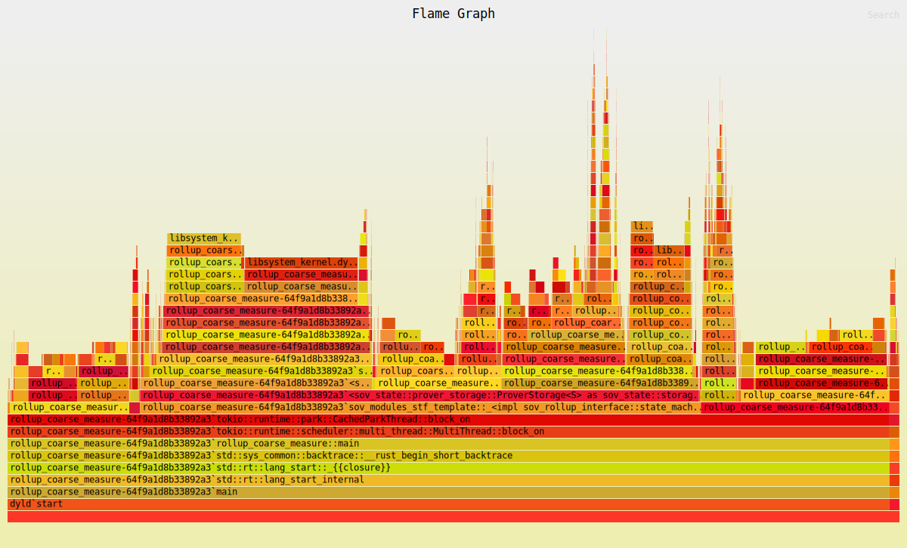

<!-- START doctoc generated TOC please keep comment here to allow auto update -->
<!-- DON'T EDIT THIS SECTION, INSTEAD RE-RUN doctoc TO UPDATE -->
**Table of Contents**  *generated with [DocToc](https://github.com/thlorenz/doctoc)*

- [Native Benchmarks](#native-benchmarks)
  - [Methodology](#methodology)
- [Makefile](#makefile)

<!-- END doctoc generated TOC please keep comment here to allow auto update -->

# Native Benchmarks
Native benchmarks refer to the performance of the rollup SDK in native mode - this does not involve proving
## Methodology
* We use the Bank module's Transfer call as the main transaction for running this benchmark. So what we're measuring is the number of value transfers that can be done per second. 
* We do not connect to the DA layer since that will be the bottleneck if we do. We pre-populate 10 blocks (configurable via env var BLOCKS) with 1 blob each containing 10,000 transactions each (configurable via env var TXNS_PER_BLOCK). 
* The first block only contains a "CreateToken" transaction. Subsequent blocks contain "Transfer" transactions.
* All token transfers are initiated from the created token's mint address

We use two scripts for benchmarking:
* **rollup_bench.rs**: This makes use of the rust criterion benchmarking framework. 
  * One issue with this is that most benching frameworks are focused on micro-benchmarks for pure functions. 
  * To get a true estimate of TPS we need to write to disk and this has a side effect for the bench framework and when it tries executing the same writes.
  * Bench frameworks (criterion, glassbench) take an iterator as an argument, and we cannot control the number of iterations directly. The framework chooses the sampling and the number of iterations.
  * Giving the entire rollup loop (for all the blocks) to criterion would require a cleanup of the data or using a new data destination for each iteration.
  * To get around the above problems, we pre-generate a "large" number of blocks and set the measurement time bounds for criterion to 20 seconds. Instead of having a loop from block_0 to block_n, we let criterion choose how many blocks to process.
  * The output of the framework is the mean time for processing a single block (containing the configured number of transactions)
```
Benchmarking rollup main loop
Benchmarking rollup main loop: Warming up for 3.0000 s
Benchmarking rollup main loop: Collecting 10 samples in estimated 24.220 s (20 iterations)
Benchmarking rollup main loop: Analyzing
rollup main loop        time:   [2.5035 s 2.7001 s 2.9122 s]
Found 1 outliers among 10 measurements (10.00%)
  1 (10.00%) high mild
```
* **rollup_coarse_measure.rs**
  * This script uses coarse grained timers (with std::time) to measure the time taken to process all the pre-generated blocks.
  * We can control the number of blocks and transactions per block with environment variables
  * There are timers around the main loop for a total measurement, as well as timers around key functions
    * begin_slot
    * apply_blob
    * end_slot
  * The script uses rust lib prettytable-rs to format the output in a readable way
  * Optionally, the script also allows generating prometheus metrics (histogram), so they can be aggregated by other tools.
```
+--------------------+--------------------+
| Blocks             | 100                |
+--------------------+--------------------+
| Txns per Block     | 10000              |
+--------------------+--------------------+
| Total              | 292.819598958s     |
+--------------------+--------------------+
| Begin slot         | 39.414µs           |
+--------------------+--------------------+
| End slot           | 243.091403746s     |
+--------------------+--------------------+
| Apply Blob         | 46.639351922s      |
+--------------------+--------------------+
| Txns per sec (TPS) | 3424.6575342465753 |
+--------------------+--------------------+
```

# Makefile
We abstract having to manually run the benchmarks by using a Makefile for the common benchmarks we want to run

The Makefile is located in the demo-rollup/benches folder and supports the following commands
* **make criterion** - generates the criterion benchmark using rollup_bench.rs
* **make basic** - supports the coarse grained timers (getting the TPS) using rollup_coarse_measure.rs
* **make prometheus** - runs rollup_coarse_measure.rs but instead of aggregating std::time directly and printing in a table, it outputs a json containing histogram metrics populated by the script
* **make flamegraph** - runs `cargo flamegraph`. On mac this requires `sudo` permissions. The script ensures some cleanup and to err on the side of caution, it deletes the `sovereign/target` folder since new artifacts can be owned by root

The Makefile supports setting number of blocks and transactions per block using BLOCKS and TXNS_PER_BLOCK env vars. Defaults are 100 blocks and 10,000 transactions per block when using the Makefile


