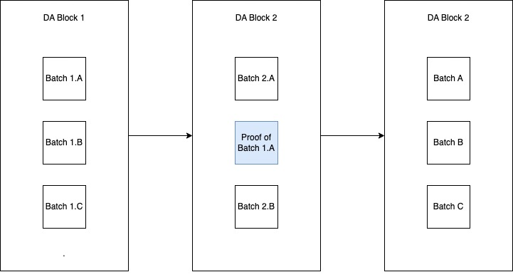

# Stratum SDK

## Overview

The Stratum SDK is a toolkit for developing zk-rollups. It provides two related sets of functionality: a generalized "full
node" implementation that is generic over an internal state transition function ("STF"), and a set of default modules
that can be used within an STF to provide common functionality. The outer "node" implementation is similar to the `tendermint`
package, except that the Stratum node also treats the consensus algorithm as an app - which allows it to support many
different L1s with minimal changes. The set of modules is conceptually similar to the Cosmos SDK, though there are some
differences in the implementation.

A Sovereign SDK chain defines a *logical* blockchain which is the combination of three distinct elements:

1. An L1 blockchain - which provides DA and consensus
2. A state transition function (written in Rust), which implements some "business logic" running over the
data provided by the L1
3. A zero-knowledge proof system capable of (1) recursion and (2) running arbitrary Rust code

Conceptually, adding a block to a Sovereign SDK happens in three steps. First, a sequencer posts a new blob of data onto
the L1 chain. As soon as the blob is finalized on chain, it is logically final. Immediately after the L1 block is finalized,
full nodes of the rollup scan through it and process all relevant data blobs in the order that they appear,
generating a new rollup state root. At this point, the block is subjectively finalized from the perspective of all full nodes.
Last but not least, prover nodes (full nodes running inside of a zkVM) perform roughly the same process as full nodes -
scanning through the DA block and processing all of the batches in order - producing proofs and posting them on chain.
(Proofs need to be posted on chain if the rollup wants to incen.tivize provers - otherwise, it's impossible to tell
which prover was first to process a given batch).
Once a proof for a given batch has been posted onchain, the batch is subjectively final to all nodes including light clients.

## Glossary

- DA chain: Short for Data Availability chain. The Layer 1 blockchain underlying a Sovereign SDK rollup.
- Slot: a "block" in the Data Availability layer. May contain many bundles of rollup transactions.
- Header: An overloaded term that may refer to (1) a block header of the *logical* chain defined by the SDK,
 (2) a block header of the underlying L1 ("Data Availability") chain or (3) a batch header.
- Batch: a group of 1 or more rollup transactions which are submitted as a single data blob on the DA chain.
- Batch Header: A summary of a given batch, posted on the L1 alongside the transactions. Rollups may define this header
to contain any relevant information, but may also choose omit it entirely.

## Apps

Following the Cosmos-SDK, we refer to the business logic of our chains as "apps". A rollup consists of two separate apps:
one which provides the consensus, and one which provides the state transition logic. These apps communicate with the full
node and via a set of predefined (required) interfaces. The required functionality of these apps is detailed in the
[Rollup Interface specification](./interfaces/interface.md).

## Outer Node

### RPC

TODO!

### P2P Network

TODO!

### Database

## Modules

TODO!

## Utilities

### Vector Commitments

The SDK provides two zk-friendly vector commitments - a simple merkle tree (ideal for commiting to simple, static data like
an array of transactions), and a versioned merkle tree (ideal for storing key-value pairs like account state).
Both merkle trees should be generic over hash function (and even hash length)
to allow customization for different zkVMs with different efficiency tradeoffs.
