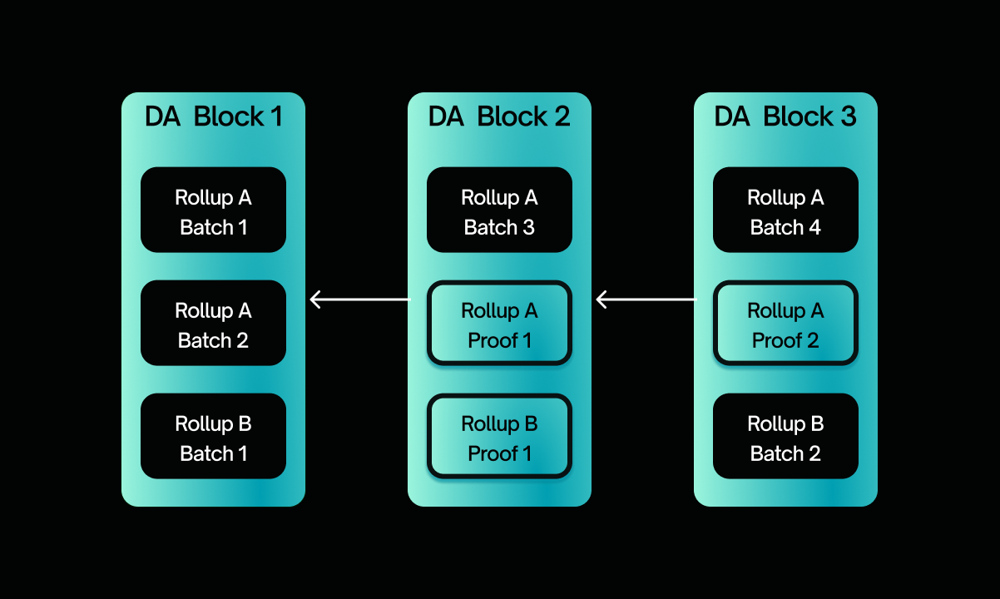

  <h1> Sovereign SDK </h1>

## Overview and Core APIs

The Sovereign SDK is a toolkit for developing zk-rollups. It provides two related sets of functionality: a generalized "full
node" implementation that is generic over an internal state transition function ("STF"), and a set of default modules
that can be used within an STF to provide common functionality. The outer "node" implementation is similar to the `tendermint`
package, except that the Sovereign node treats the consensus algorithm as a pluggable module - which allows it to support 
many different L1s with minimal changes. The set of modules is conceptually similar to the Cosmos SDK, though there are 
some differences in the implementation.

A Sovereign SDK chain defines a *logical* blockchain which is the combination of three distinct elements:

1. An L1 blockchain - which provides DA and consensus
2. A state transition function (written in Rust), which implements some "business logic" running over the
data provided by the L1
3. A zero-knowledge proof system capable of (1) recursion and (2) running arbitrary Rust code

The required functionality of each of these core components can be found in the [Rollup Interface specification](./interfaces).

Conceptually, adding a block to a Sovereign SDK happens in three steps. First, a sequencer posts a new blob of data onto
the L1 chain. As soon as the blob is finalized on chain, it is logically final. Immediately after the L1 block is finalized,
full nodes of the rollup scan through it and process all relevant data blobs in the order that they appear,
generating a new rollup state root. At this point, the block is subjectively finalized from the perspective of all full nodes.
Last but not least, prover nodes (full nodes running inside of a zkVM) perform roughly the same process as full nodes -
scanning through the DA block and processing all of the batches in order - producing proofs and posting them on chain.
(Proofs need to be posted on chain if the rollup wants to incentivize provers - otherwise, it's impossible to tell
which prover was first to process a given batch).
Once a proof for a given batch has been posted onchain, the batch is subjectively final to all nodes including light clients.

## Glossary

- DA chain: Short for Data Availability chain. The Layer 1 blockchain underlying a Sovereign SDK rollup.
- Slot: a "block" in the Data Availability layer. May contain many bundles of rollup transactions.
- Header: An overloaded term that may refer to (1) a block header of the *logical* chain defined by the SDK,
 (2) a block header of the underlying L1 ("Data Availability") chain or (3) a batch header.
- Batch: a group of 1 or more rollup transactions which are submitted as a single data blob on the DA chain.
- Batch Header: A summary of a given batch, posted on the L1 alongside the transactions. Rollups may define this header
to contain any relevant information, but may also choose omit it entirely.
- JMT: Jellyfish Merkle Tree - an optimized sparse merkle tree invented by Diem and used in many modern blockchains.

## Components

As described in the [overview](./overview.md#overview-and-core-apis), the Sovereign SDK defines a standard interface to
allow state transition logic to communicate with DA layers. While we expect state transition functions to exhibit lots
of diversity, there are only a relatively small number of popular data availability layers, and we expect nearly
all Sovereign rollups to be built using just a handful of them. For this reason, we'll provide implementations of
the DaLayer interface for several popular DA layers. This section will be filled out over time as implementations
are added.

### Jupiter

[Jupiter](https://github.com/Sovereign-Labs/Jupiter) is our adapter for Celestia.
It's currently compatible with Celestia Node release v0.5.0, but may be updated without warning until
Celestia reaches version 1.0. Please note: Jupiter is a research quality prototype, and should not be used
for production workflows at this time.

## Outer Node

The Sovereign stack can be split into two parts - a logical "state_machine" which is updated in-circuit, and an outer
"Node" implementation, which replicates that state machine across different computers. This repository is primarily
concerned with the logical state machine, but it does provide a few helper traits which need to be aware of the
state machine but are not themselves zk-proven. This section describes the outer node in order to give a more
complete picture of the SDK and its uses. But, keep in mind that the actual implementation of the node does not live
in this repository.

### RPC

The node will provide a standardized RPC, which aims to be compatible with Coinbase Rosetta. Specification to be developed.

### P2P Network

The node will provide p2p networking by default. Specification to be developed.

### Database

The Sovereign node currently provides storage backed by RocksDB for persisting state, witnesses (merkle proofs), blocks
headers, and events. The current storage implementation is organized around the SDK's `Schema` trait, which describes
how to convert a byte-oriented key-value store into a typed key-value store using arbitratry serialization logic.
Each database column has its own `Schema`, which allows developers to use different encodings to optimize
their resource consumption.

On top of the typed `Schema`-based database, the SDK provides a database wrapper tailored to the blockchain
use case - with application-aware caching for state data, block information, and transactions.

## Modules

In addition to its Core abstractions and node implementation, the SDK provides some helpful modules to aid developers
in writing their business logic. This section will be expanded over time as the SDK's functionality develops.

### Storage

The Sovereign SDK will provide a storage module optimized for use in zk state transition functions. In "normal" mode,
the database will act as a standard key-value store backed by RocksDB. In "verifier" mode, it will lazily read data from
the host and authenticate each read against the output state root of the previous block.
In "prover" mode it will read both data and witnesses from RocksDB.

The storage module will be implemented using a jellyfish merkle tree (JMT). For efficiency in a variety of zkVMs, the SDK's
[implementation of the JMT](https://github.com/Sovereign-Labs/jellyfish-merkle-generic) is generic over your choice of
hash function and digest size - we strongly recommend using a hash function tailored to your choice of zkVM.

### Bridging

The SDK will provide a module to support aggregation-based bridging between chains. While the low level design of this module
is under development, we'll cover the key ideas here.

Bridges can be divided into two categories:

- Trusted bridges: These bridges rely on a trusted third party to facilitate cross-chain communication. The third party
may be centralized or distributed, but (by definition) is distinct from the validator set of either chain. Bridges in
this category are typically fast and cheap, but are more prone to failures than light-client bridges because trusted
third parties are often vulnerable. Examples of trusted bridges include Wormhole, Polygon Bridge, Hyperlane, Nomad,
and many more.
- Light-client bridges: As the name suggests, light-client bridges require two chains to run light-clients of each
other in order to communicate. These bridges are typically expensive, so chains typically only participate in a few
light client bridges. However, light-client bridges between two established are very secure - as secure as the
weaker of the two validator sets involved. The most prominent light-client bridging protocol is IBC.

The Sovereign SDK's bridging protocol is similar to a light-client bridge. It works rougly like this: Every Sovereign
rollup is already creating zero-knowledge proofs of its own execution. By aggregating these proofs (off-chain),
we can create a meta-proof which attests to the state of all Sovereign rollups on a given DA layer at a given
point in time. Then, by verifying this meta-proof on each rollup, we can establish a shared view of the network
state, which we can use to pass arbitrary messages between rollups. (In practice, we don't need a global view.
Any two rollups with a view of each other's state can pass messages.)

While they are considered by many to be the gold-standard for secure bridges, light-client bridges still
have two failure modes:

- Funds can be lost if one chain suffers a long-distance reorg (longer than the supposed finality period).
- Funds can be lost if a validator set executes an invalid state transition.

- Funds cannot be lost due to reorgs *as long as both rollups share a DA layer*. This is because the chains
are no longer asynchronous, so if one reorgs the other is guaranteed to reorg as well.
- Funds cannot be lost due to invalid state transitions, since each chain validates the full state transition
rather than just the validator set signatures.

## Utilities

### Vector Commitments

The SDK provides two zk-friendly vector commitments - a
[simple merkle tree](https://github.com/Sovereign-Labs/nmt-rs/blob/master/src/simple_merkle/tree.rs) for commiting to
static data like the arrays of transactions in a block, and a [versioned merkle tree](./overview.md#storage) for storing
state. Both merkle trees are generic over hash function (and even digest length) to allow customization for different zkVMs
with different efficiency tradeoffs.
